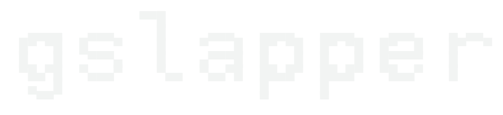

<div align="center">
  
</div>

<br>

**gSlapper** is a drop-in replacement for mpvpaper that plays both videos and static images. It uses GStreamer instead of libmpv: one pipeline decodes for all monitors, frames reach the GPU without copies, and memory stays flat over long sessions on any compositor, including NVIDIA where mpvpaper leaks.

## Quick Start

```bash
# Video wallpaper
gslapper -o "loop" DP-1 /path/to/video.mp4

# Static image wallpaper
gslapper -o "fill" DP-1 /path/to/image.jpg

# All monitors
gslapper -o "loop" '*' /path/to/video.mp4
```

Full documentation available at: https://nomadcxx.github.io/gSlapper/

## Features

- Play videos (MP4, MKV, WebM) and images (JPEG, PNG, WebP, GIF)
- Animated GIF playback with correct frame timing and looping (requires gst-libav; shows the first frame statically without it)
- Fade transitions between images
- Multi-monitor support
- IPC control via Unix socket (pause, resume, change wallpaper)
- Scaling modes: fill, stretch, original, panscan
- Lower CPU, RAM, and GPU use than mpvpaper on any Wayland compositor

## Installation

### Arch Linux
```bash
yay -S gslapper
```

### Debian / Ubuntu / Fedora

Prebuilt packages are attached to every [release](https://github.com/Nomadcxx/gSlapper/releases/latest):

```bash
# Debian 13 (also Ubuntu 25.x)
sudo apt install ./gslapper_<version>_debian13_amd64.deb

# Ubuntu 24.04
sudo apt install ./gslapper_<version>_ubuntu24.04_amd64.deb

# Fedora 42+
sudo dnf install ./gslapper-<version>-1.fedora42.x86_64.rpm
```

### Manual Build
```bash
git clone https://github.com/Nomadcxx/gSlapper.git
cd gSlapper
meson setup build --prefix=/usr/local
ninja -C build
sudo ninja -C build install
```

### Nix / NixOS

```bash
git clone https://github.com/Nomadcxx/gSlapper.git
cd gSlapper
nix build
./result/bin/gslapper --help
```

For development:

```bash
nix develop
```

See [Nix Installation Guide](docs-site/content/docs/getting-started/nix-installation.md) for system integration options.

## License

GPL-3.0 License - see [LICENSE](LICENSE)

## Credits

- [mpvpaper](https://github.com/GhostNaN/mpvpaper)
- [swww](https://github.com/Horus645/swww)
- [GStreamer](https://gstreamer.freedesktop.org/)
- [Clapper](https://github.com/Rafostar/clapper)

---

Built by [RAMA](https://github.com/Nomadcxx) — terminal-native tooling for the linux desktop.
[More projects →](https://github.com/Nomadcxx) · [Sponsor ♥](https://github.com/sponsors/Nomadcxx)
