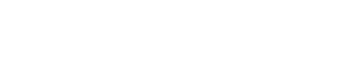

# gSlapper Documentation

  

 

**gSlapper** is a high-performance wallpaper manager for Wayland that combines the best of [swww](https://github.com/Horus645/swww) and [mpvpaper](https://github.com/GhostNaN/mpvpaper). It uses GStreamer instead of libmpv, providing faster performance, better efficiency, and fixes memory leaks on NVIDIA Wayland systems while offering superior multi-monitor support.

## Quick Links

- [Installation](getting-started/installation.md) - Get gSlapper installed on your system
- [Quick Start](getting-started/quick-start.md) - Get up and running in minutes
- [Getting Started Guide](getting-started/index.md) - Setup and configuration
- [User Guide](user-guide/index.md) - Complete tutorial and features
- [Advanced Topics](advanced/index.md) - Prerequisites and advanced features
- [Systemd Service](systemd-service-setup.md) - Automatic wallpaper restoration
- [Troubleshooting](advanced/troubleshooting.md) - Common issues and solutions

## Key Features

- **Video Wallpapers** - Plays MP4, MKV, WebM, and other video formats
- **Static Images** - Supports JPEG, PNG, WebP, and GIF
- **Fade Transitions** - Smooth transitions between wallpapers
- **Multi-Monitor** - Works with multiple displays independently
- **IPC Control** - Change wallpapers at runtime via Unix socket
- **Scaling Modes** - Choose between fill, stretch, original, and panscan
- **Wayland Native** - Built for wlroots compositors like Hyprland and Sway

## Why GStreamer?

gSlapper replaces libmpv with GStreamer to solve memory leaks on NVIDIA Wayland systems, improve GPU resource management, and provide more reliable multi-monitor support. GStreamer offers mature Wayland/EGL integration and proper hardware acceleration.

## License

MIT License - see [LICENSE](../LICENSE)

## Acknowledgments

- [mpvpaper](https://github.com/GhostNaN/mpvpaper) - Original inspiration
- [swww](https://github.com/Horus645/swww) - Static wallpaper inspiration
- [GStreamer](https://gstreamer.freedesktop.org/) - Multimedia framework
- [Clapper](https://github.com/Rafostar/clapper) - GStreamer integration patterns
